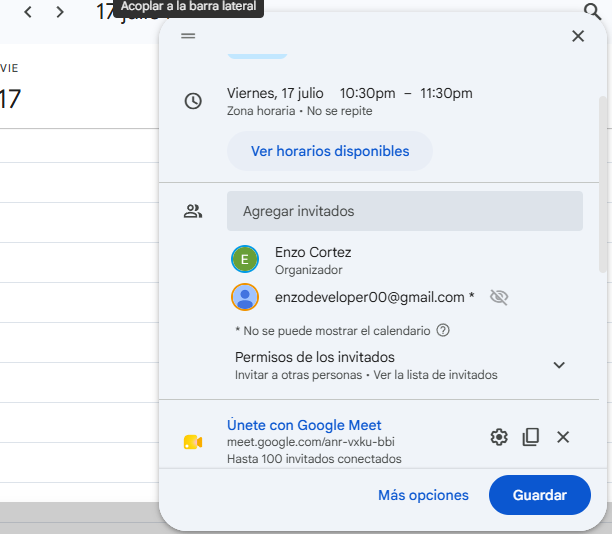

# Plan de Implementación: Módulo Asistente IA (Proyecto Asist)

**Repositorio Compartido:** [Enlace a tu GitHub]
**Objetivo:** Desarrollar un agente IA sencillo que asista al profesor en la planificación de clases, notificando alertas tempranas (ej. clima) basándose en los datos del Proyecto Asist.

## 📋 Lista Dinámica de Tareas y Prioridades

- [x] **[Alta]** Inicializar repositorio en GitHub y crear entorno virtual local.
- [ ] **[Alta]** Diseñar el prompt principal (System Prompt) para el Gestor de Agentes.
- [ ] **[Media]** Implementar autocompletado en el Editor para el script de conexión.
- [ ] **[Media]** Integrar simulación de API externa (Ej. Clima).
- [ ] **[Baja]** Ejecutar Prueba de Navegador y capturar pantalla de validación visual.

## 👥 Plan Paso a Paso y Asignación de Roles

1. **Fase de Análisis (Rol: Agente de Investigación)**
   * Analizar los datos de asistencia previos del Proyecto Asist.
   * Seleccionar la API meteorológica más eficiente para cruzar datos.
2. **Fase de Desarrollo (Rol: Agente de Programación / Editor)**
   * Escribir el script de conexión a la API utilizando autocompletado.
   * Generar la estructura de la base de datos simulada en SQLite.
3. **Fase de Auditoría (Rol: Desarrollador Humano / Comentarios)**
   * Revisar el código generado por la IA.
   * Agregar comentarios lógicos, validar la seguridad (JWT) y aprobar el despliegue.

## 📸 Informe de Recorrido y Avance

* **Día 1:** Se logró configurar exitosamente el entorno `.venv` y se realizó el primer commit en la rama principal aislando las dependencias (`.gitignore`).
* **Día 2 (Simulación):** Se ejecutó el script base. El agente generó la estructura solicitada sin errores de sintaxis. 
* **Captura de evidencia:** *(Insertar aquí captura de pantalla de la terminal mostrando el entorno activado o la prueba del navegador exitosa)*.

## 📅 Planificación y Sincronización (Google Calendar)
Para coordinar las entregas del equipo y sincronizar las fases de desarrollo del Módulo Asistente IA, se programó un hito clave utilizando Google Calendar:

* **Evento:** Sprint Review: Entrega Prototipo Asistente Clima (Proyecto Asist)
* **Objetivo:** Realizar la demostración técnica del prototipo con la API de clima integrada y validar el uso seguro del archivo de variables de entorno (`.env`).
* **Sincronización:** Se añadieron colaboradores al evento para simular la dinámica ágil de desarrollo y asegurar que las pruebas de navegador se coordinen en simultáneo.

*Captura de planificación:*


## 🌳 Árbol de Contexto (Organización del Proyecto)
Para que el Agente de IA (autocompletado del editor) comprenda la estructura del proyecto y sus dependencias de forma eficiente, se organizó el entorno de desarrollo estableciendo el siguiente árbol de contexto:

```text
Modulo_Asistente_IA/
├── .venv/               # Entorno virtual aislado (Excluido en .gitignore)
├── .env                 # Variables de entorno seguras (API Keys, Secret Key)
├── Asist_app/           # Aplicación principal del asistente (Vistas y lógica)
├── modulo_asist_IA/     # Configuración global del proyecto Django
├── .gitignore           # Reglas de exclusión para el repositorio
├── manage.py            # Gestor de línea de comandos del framework
└── README.md            # Documentación y plan de implementación     
